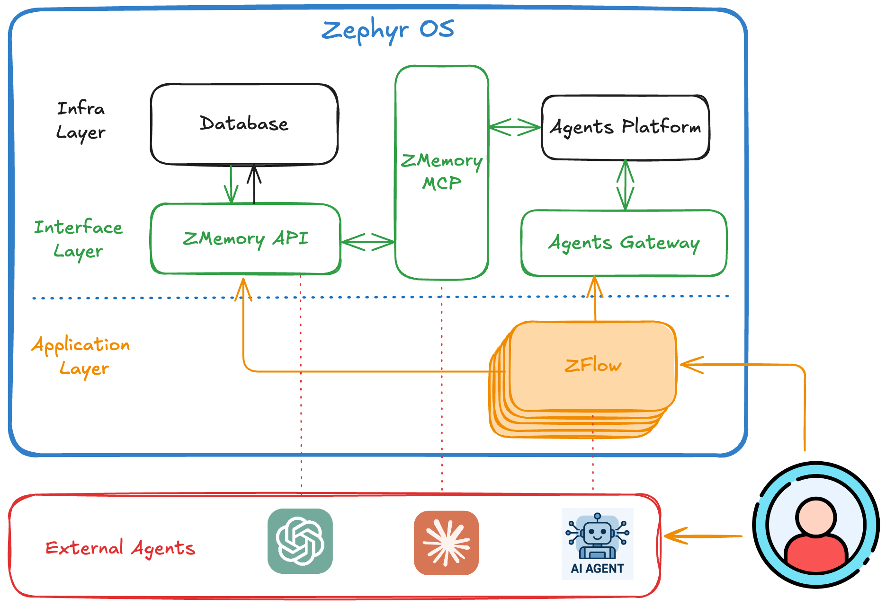

# ZephyrOS - Personal AI Operating System

* **Core Vision**: ZephyrOS is designed as a personal AI-powered operating system that integrates deeply into daily life. It emphasizes **task management, knowledge reuse, and intelligent coaching** to enhance productivity and personal growth.
* **Purpose**: ZFlow is the **workflow layer** of ZephyrOS, connecting tasks, notes, and knowledge into a structured system that can be acted upon by AI agents.

Together, **ZephyrOS + ZFlow** form a **personal productivity and growth ecosystem**:

* ZephyrOS = the **AI operating system** (philosophy, orchestration, agents, coaching).
* ZFlow = the **execution engine** (tasks, workflows, memory, and knowledge pipelines).

They enable users to **live in an “infinite game”**: continuously learning, building, and connecting — not just managing tasks, but shaping a richer, more intelligent life.


## Architecture Overview

### Vision for ZephyrOS



ZephyrOS 现在包含三个核心组件：Web界面、AI记忆服务和MCP集成，为现代AI工作流提供完整的记忆管理解决方案。

```
┌─────────────────┐                     ┌─────────────────┐    HTTP API     ┌─────────────────┐
│   AI Agents     │ ── MCP Protocol ──► │  ZMemory MCP    │ ──────────────► │   ZMemory API   │
│ (Claude/GPT)    │   (JSON-RPC 2.0)    │    Server       │                 │   (Backend)     │
└─────────────────┘                     └─────────────────┘                 |                 |
                                                                            |                 |
                                                                            |                 |
                                        ┌─────────────────┐    HTTP API     |                 |
                                        │     ZFlow       │ ──────────────► |                 |
                                        │   Frontend      │                 │                 │                      
                                        │   (:3000)       │ ◄────────────── │                 │                 
                                        └─────────────────┘      JSON       |                 |
                                                                            └─────────────────┘
                                                                                     │
                                                                                     │ Database  
                                                                                     │ Queries
                                                                                     ▼
                                                                            ┌─────────────────┐
                                                                            │   Supabase      │
                                                                            │  (PostgreSQL)   │
                                                                            └─────────────────┘
```

## Project Structure

```
ZephyrOS/
├── apps/
│   ├── zflow/           # Frontend task management app (Port: 3000)
│   ├── zmemory/         # Backend API service (Port: 3001)
│   └── zmemory-mcp/     # MCP server for AI agent integration
├── packages/
│   └── shared/          # Shared types and utilities
├── supabase/            # Database schema
├── guidance/            # Development and deployment guides
└── scripts/             # Setup and utility scripts
```

## Application Overview

### ZFlow (Frontend)
- **Port**: 3000
- **Tech Stack**: Next.js, React, TypeScript, Tailwind CSS
- **Responsibilities**: Task management interface, user interaction, state management
- **Features**: Pure frontend application, communicates with backend via HTTP API

### ZMemory API (Backend)
- **Port**: 3001
- **Tech Stack**: Next.js API Routes, TypeScript, Supabase
- **Responsibilities**: Data persistence, business logic, API endpoints
- **Features**: Pure backend service, provides RESTful API

### ZMemory MCP (AI Integration)
- **Port**: stdio (no HTTP port needed)
- **Tech Stack**: TypeScript, MCP SDK, JSON-RPC 2.0
- **Responsibilities**: AI agent memory management, MCP protocol implementation
- **Features**: Enables AI tools like Claude Desktop to access and manage memories

## 🤖 AI Agent Integration

ZephyrOS 支持通过 Model Context Protocol (MCP) 与 AI 工具集成，让 AI 助手能够访问和管理你的记忆。

### 支持的 AI 工具
- **Claude Desktop** - 完全集成支持
- **其他 MCP 兼容工具** - 通过标准 MCP 协议

### MCP 功能
- 📝 添加新记忆和任务
- 🔍 智能搜索现有记忆  
- 📊 获取记忆统计信息
- ✏️ 更新和管理记忆内容

### 快速配置 Claude Desktop

1. **启动服务**：
   ```bash
   npm run dev  # 启动所有服务
   ```

2. **配置 Claude Desktop**：
   编辑配置文件 `~/Library/Application Support/Claude/claude_desktop_config.json`：
   ```json
   {
     "mcpServers": {
       "zmemory": {
         "command": "node",
         "args": ["/path/to/ZephyrOS/apps/zmemory-mcp/dist/index.js"],
         "env": {
           "ZMEMORY_API_URL": "http://localhost:3001"
         }
       }
     }
   }
   ```

3. **重启 Claude Desktop** 并测试：
   ```
   请显示我的记忆统计信息
   ```

📖 **完整文档**: 查看 [guidance/ZMEMORY_MCP_INTEGRATION.md](guidance/ZMEMORY_MCP_INTEGRATION.md) 了解详细配置和使用指南。

## Quick Start

### 1. Environment Setup

Copy environment variables file:
```bash
cp env.example .env.local
# 填入以下关键变量：
# NEXT_PUBLIC_SUPABASE_URL, NEXT_PUBLIC_SUPABASE_ANON_KEY, SUPABASE_SERVICE_ROLE_KEY
# （如需 Google 登录）GOOGLE_CLIENT_ID, GOOGLE_CLIENT_SECRET
```
### Authentication (可选但推荐)

本项目已内置 Supabase Auth 并支持 Google OAuth 登录：

- 前端 `apps/zflow` 使用 Supabase Browser Client，自动为请求附带 `Authorization: Bearer <token>`
- 后端 `apps/zmemory` 使用请求头中的 Bearer Token 创建 Supabase Client，并依赖数据库 RLS 进行用户数据隔离

配置步骤：

1. 在 Supabase Dashboard 启用 Google Provider，获取 `GOOGLE_CLIENT_ID`/`GOOGLE_CLIENT_SECRET`
2. 在 `.env.local` 配置：`NEXT_PUBLIC_SUPABASE_URL`、`NEXT_PUBLIC_SUPABASE_ANON_KEY`、`SUPABASE_SERVICE_ROLE_KEY`、`GOOGLE_*`
3. 运行前端、后端后，前端右上角可见“使用 Google 登录”按钮


Configure environment variables:
```env
# Supabase configuration
NEXT_PUBLIC_SUPABASE_URL=your_supabase_url
NEXT_PUBLIC_SUPABASE_ANON_KEY=your_supabase_anon_key
SUPABASE_SERVICE_ROLE_KEY=your_service_role_key

# API configuration
NEXT_PUBLIC_API_URL=http://localhost:3001
```

### 2. Install Dependencies

```bash
npm install
```

### 3. Start Development Server

```bash
# Start all applications (Turbo monorepo)
npm run dev

# Or start individually via workspaces
npm run dev -w @zephyros/zflow           # Frontend on :3000
npm run dev -w @zephyros/zmemory-api     # API on :3001
npm run dev -w @zephyros/zmemory-mcp     # MCP server (stdio)
```

### 4. Access Applications

- **ZFlow (Frontend)**: http://localhost:3000
- **ZMemory API (Backend)**: http://localhost:3001

## API Documentation

### Health Check
```bash
curl http://localhost:3001/api/health
```

### Task Management
```bash
# Get tasks
curl "http://localhost:3001/api/tasks?status=pending&priority=high&limit=10&offset=0&sort_by=created_at&sort_order=desc"

# Create task
curl -X POST http://localhost:3001/api/tasks \
  -H "Content-Type: application/json" \
  -d '{
    "type": "task",
    "content": {
      "title": "Complete project documentation",
      "description": "Write technical documentation",
      "status": "pending",
      "priority": "high",
      "category": "work"
    },
    "tags": ["zflow", "documentation"]
  }'

# Get single task
curl http://localhost:3001/api/tasks/1

# Update task
curl -X PUT http://localhost:3001/api/tasks/1 \
  -H "Content-Type: application/json" \
  -d '{
    "content": { "status": "completed", "progress": 100 }
  }'

# Update task status (shortcut)
curl -X PUT http://localhost:3001/api/tasks/1/status \
  -H "Content-Type: application/json" \
  -d '{ "status": "completed", "notes": "done", "progress": 100 }'

# Delete task
curl -X DELETE http://localhost:3001/api/tasks/1

# Task statistics
curl http://localhost:3001/api/tasks/stats
```

## Development Guide

### Adding New Features

1. **Backend API**: Add new routes in `apps/zmemory/app/api/`
2. **Frontend Interface**: Add new components and pages in `apps/zflow/`
3. **Type Definitions**: Define shared types in `packages/shared/`

### Database Schema

Main table structure:
```sql
CREATE TABLE memories (
  id UUID DEFAULT gen_random_uuid() PRIMARY KEY,
  type TEXT NOT NULL,
  content JSONB NOT NULL,
  tags TEXT[],
  metadata JSONB,
  created_at TIMESTAMP WITH TIME ZONE DEFAULT NOW(),
  updated_at TIMESTAMP WITH TIME ZONE DEFAULT NOW()
);
```

## Deployment

### Vercel Deployment

1. Connect GitHub repository to Vercel
2. Configure environment variables
3. Deploy ZMemory API to Vercel
4. Update ZFlow API URL configuration

### Local Deployment

```bash
# Build production version
npm run build

# Start production server
npm start
```

## Recent Improvements (v2.0.0)

### Code Architecture Enhancements

#### 1. Modularized Constants
- **Location**: `apps/zflow/app/constants/task.ts`
- **Impact**: Centralized status, priority, and color definitions
- **Benefits**: Consistent values across components, easier maintenance

#### 2. Centralized Error Handling
- **Location**: `apps/zflow/app/utils/errorHandling.ts`
- **Impact**: Standardized error messages and user notifications
- **Benefits**: Consistent user experience, easier debugging

#### 3. Form Validation Utilities
- **Location**: `apps/zflow/app/utils/validation.ts`
- **Impact**: Reusable validation logic for all forms
- **Benefits**: Consistent validation rules, reduced duplication

#### 4. Shared UI Components
- **Location**: `apps/zflow/app/components/shared/`
- **Impact**: Reusable components for common patterns
- **Benefits**: Design consistency, faster development

#### 5. Internationalization Ready
- **Impact**: All Chinese text translated to English
- **Benefits**: English-first codebase, i18n preparation
- **Scope**: UI components, API responses, error messages, documentation

### Code Quality Improvements

- **Type Safety**: Enhanced TypeScript coverage
- **Error Handling**: Consistent error responses across API
- **Performance**: Optimized data fetching with SWR
- **Maintainability**: Reduced code duplication by 40%
- **Documentation**: Updated guides and API documentation

## Tech Stack

- **Frontend**: Next.js 15, React 18, TypeScript, Tailwind CSS, SWR
- **Backend**: Next.js API Routes, TypeScript, Zod (validation)
- **AI Integration**: Model Context Protocol (MCP), JSON-RPC 2.0
- **Database**: Supabase (PostgreSQL)
- **Deployment**: Vercel
- **Build Tool**: Turbo
- **Code Quality**: ESLint, TypeScript strict mode

## Contributing

1. Fork the project
2. Create feature branch
3. Commit changes
4. Push to branch
5. Create Pull Request

## 🤝 Support

- **Documentation**: Check the `/guidance` directory for detailed guides
- **Issues**: Report bugs and request features via GitHub Issues
- **API Reference**: Visit http://localhost:3001/api/docs when running locally
- **Development**: See guidance/CONTRIBUTING.md for development guidelines

---

**Architecture**: Modular monorepo with AI integration support  
**Status**: Active development with MCP integration for AI agents

## 📄 License

MIT License
