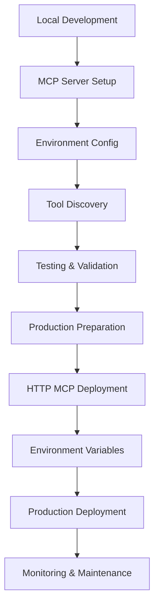

# MCP Integration Documentation Suite

## Overview

This documentation suite provides comprehensive coverage of the Model Context Protocol (MCP) integration in ZFlow, from initial design concepts to production deployment and troubleshooting.

## Documentation Structure

### 📋 [MCP_INTEGRATION_DESIGN.md](./MCP_INTEGRATION_DESIGN.md)
**Architecture & Design Documentation**

- **Purpose**: Technical architecture and design patterns
- **Audience**: Senior developers, architects, technical leads
- **Contents**:
  - System architecture overview with diagrams
  - Core component design patterns (Factory, Singleton, Strategy, Bridge)
  - Environment-specific behaviors and configurations
  - Tool integration flow and data transformations
  - Security considerations and performance optimizations
  - Future enhancement roadmap

**Key Sections**:
- Architecture Overview with visual diagrams
- Core Components (MCP Client, HTTP Client, Bridge, Status Indicator)
- Environment Detection and Auto-switching Logic
- Tool Discovery, Registration, and Execution Flow
- Error Handling and Monitoring Strategies

### 🔄 [MCP_DEVELOPMENT_WORKFLOW.md](./MCP_DEVELOPMENT_WORKFLOW.md)
**Development Process & Best Practices**

- **Purpose**: Step-by-step development workflow and best practices
- **Audience**: All developers working with MCP integration
- **Contents**:
  - Complete development lifecycle from local setup to production
  - Phase-by-phase implementation guide
  - Testing strategies and validation procedures
  - Code organization patterns and conventions
  - Migration and maintenance procedures

**Key Sections**:
- Development Phases (Local Setup → Testing → Production → Deployment)
- Environment Configuration Patterns
- Testing Strategies (Unit, Integration, E2E)
- Debugging Guide with Common Issues
- Performance Monitoring and Log Analysis

### 🔧 [MCP_TROUBLESHOOTING_GUIDE.md](./MCP_TROUBLESHOOTING_GUIDE.md)
**Problem Solving & Diagnostic Tools**

- **Purpose**: Comprehensive troubleshooting and problem resolution
- **Audience**: Developers, DevOps, support teams
- **Contents**:
  - Common issues categorized by environment and component
  - Step-by-step debugging procedures
  - Diagnostic tools and health monitoring
  - Performance optimization techniques
  - Environment-specific problem resolution

**Key Sections**:
- Development Issues (Connection failures, Tool discovery, Status updates)
- Production Issues (HTTP failures, Rate limiting, Timeouts)
- Environment-Specific Troubleshooting (Vercel, Local development)
- Diagnostic Tools (Connection tester, Performance monitor, Health dashboard)

## Quick Reference

### For New Developers
1. Start with **MCP_INTEGRATION_DESIGN.md** to understand the architecture
2. Follow **MCP_DEVELOPMENT_WORKFLOW.md** for setup and development process
3. Keep **MCP_TROUBLESHOOTING_GUIDE.md** handy for issue resolution

### For DevOps/Production Support
1. Review production sections in **MCP_INTEGRATION_DESIGN.md**
2. Focus on deployment sections in **MCP_DEVELOPMENT_WORKFLOW.md**
3. Use **MCP_TROUBLESHOOTING_GUIDE.md** for incident response

### For Technical Leads
1. **MCP_INTEGRATION_DESIGN.md** provides architectural overview
2. **MCP_DEVELOPMENT_WORKFLOW.md** shows team processes
3. **MCP_TROUBLESHOOTING_GUIDE.md** helps understand operational challenges

## Key Integration Points

### Environment Configuration
```env
# Development
NODE_ENV=development
MCP_SERVER_PATH=./path/to/local/mcp-server

# Production
NODE_ENV=production
HTTP_MCP_URL=https://your-mcp-service.vercel.app
ZMEMORY_API_KEY=your-api-key
```

### Core Components
- **MCP Client** (`mcp-client.ts`): Environment-aware connection manager
- **HTTP Client** (`mcp-http-client.ts`): Production HTTP-based client
- **MCP Bridge** (`mcp-bridge.ts`): Tool registration and provider integration
- **Status Indicator** (`MCPStatusIndicator.tsx`): Real-time status visualization

### API Endpoints
- `GET /api/agents/mcp/status`: System health and connection status
- `POST /api/agents/mcp/test`: Connection testing and validation

## Development Workflow Summary



## Architecture Summary

```mermaid
graph TB
    UI[Agent UI] --> Bridge[MCP Bridge]
    Bridge --> Client[MCP Client]

    Client --> |Development| Local[Local MCP Server]
    Client --> |Production| HTTP[HTTP MCP Service]

    Bridge --> OpenAI[OpenAI Provider]
    Bridge --> Anthropic[Anthropic Provider]

    Status[Status Indicator] --> API[/api/agents/mcp/status]
    API --> Client
    API --> Bridge
```

## Common Operations

### Development Setup
```bash
# 1. Clone and setup MCP server
git clone https://github.com/your-org/zmemory-mcp
cd zmemory-mcp && npm install

# 2. Configure environment
echo "MCP_SERVER_PATH=../zmemory-mcp/dist/index.js" >> .env.local

# 3. Start development
npm run dev
```

### Production Deployment
```bash
# 1. Deploy MCP service
cd zmemory-mcp && vercel --prod

# 2. Configure production environment
# Set HTTP_MCP_URL and ZMEMORY_API_KEY in Vercel dashboard

# 3. Deploy main application
vercel --prod
```

### Health Monitoring
```bash
# Check MCP status
curl https://your-app.vercel.app/api/agents/mcp/status

# Monitor logs
vercel logs --follow | grep -i mcp
```

## Support & Maintenance

### Regular Tasks
- **Weekly**: Review MCP connection health and tool availability
- **Monthly**: Update MCP server dependencies and tool definitions
- **Quarterly**: Performance review and optimization

### Emergency Procedures
1. **MCP Service Down**: Check **MCP_TROUBLESHOOTING_GUIDE.md** → Production Issues
2. **Tool Failures**: Use diagnostic tools from troubleshooting guide
3. **Performance Issues**: Apply optimization techniques from development workflow

### Contact & Resources
- **Technical Issues**: Reference troubleshooting guide first
- **Architecture Questions**: Review design documentation
- **Process Questions**: Follow development workflow guide

This documentation suite provides complete coverage of MCP integration, enabling teams to effectively develop, deploy, and maintain MCP-enabled features in ZFlow.