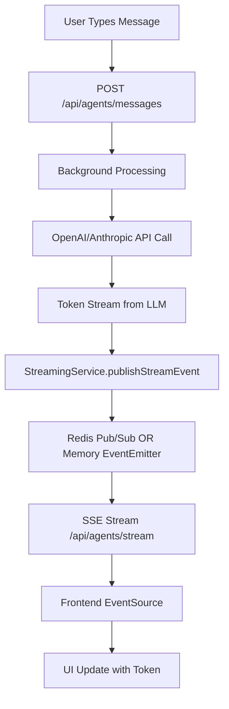

# ZFlow Agents Streaming Implementation Guide

This guide provides detailed technical information about the streaming implementation in the ZFlow agents system, including how to debug, monitor, and extend the streaming functionality.

## Table of Contents

- [Streaming Architecture Deep Dive](#streaming-architecture-deep-dive)
- [SSE Implementation Details](#sse-implementation-details)
- [Redis vs Memory Streaming](#redis-vs-memory-streaming)
- [Frontend SSE Handling](#frontend-sse-handling)
- [Debugging Streaming Issues](#debugging-streaming-issues)
- [Performance Optimization](#performance-optimization)
- [Extending Streaming Capabilities](#extending-streaming-capabilities)

## Streaming Architecture Deep Dive

### Component Interaction Flow



### Key Classes and Their Roles

#### StreamingService (`apps/zflow/app/lib/agents/streaming.ts`)
```typescript
export class StreamingService {
  // Handles dual-mode streaming (Redis/Memory)
  // Manages SSE stream creation and event publishing
  // Provides failover from Redis to Memory
  
  async publishStreamEvent(sessionId: string, event: StreamingResponse)
  async subscribeToStream(sessionId: string, callback: Function)
  createSSEStream(sessionId: string): ReadableStream<Uint8Array>
}
```

#### MemoryStreamingService (`apps/zflow/app/lib/agents/memory-streaming.ts`)
```typescript
export class MemoryStreamingService {
  // EventEmitter-based streaming for development
  // In-process event distribution
  // No external dependencies
  
  private eventEmitter = new EventEmitter()
}
```

#### SessionManager (`apps/zflow/app/lib/agents/session-manager.ts`)
```typescript
export class SessionManager {
  // Dual storage: Redis for production, Memory for development
  // Session lifecycle management with TTL
  // Message persistence and retrieval
  
  async createSession(userId: string, agentId: string): Promise<ChatSession>
  async addMessage(sessionId: string, message: AgentMessage)
}
```

## SSE Implementation Details

### Server-Side SSE Stream Creation

```typescript
// apps/zflow/app/lib/agents/streaming.ts:94-145
createSSEStream(sessionId: string): ReadableStream<Uint8Array> {
  const encoder = new TextEncoder()
  let unsubscribe: (() => void) | null = null

  return new ReadableStream({
    start: async (controller) => {
      // 1. Send initial connection confirmation
      const greeting = `data: ${JSON.stringify({ type: 'connected', sessionId })}\n\n`
      controller.enqueue(encoder.encode(greeting))

      // 2. Subscribe to event stream (Redis or Memory)
      unsubscribe = await this.subscribeToStream(sessionId, (event) => {
        try {
          // 3. Format as SSE and send to client
          const data = `data: ${JSON.stringify(event)}\n\n`
          controller.enqueue(encoder.encode(data))

          // 4. Close stream on completion
          if (event.type === 'end' || event.type === 'error') {
            controller.close()
          }
        } catch (error) {
          console.error('Error sending SSE event:', error)
          controller.error(error)
        }
      })

      // 5. Heartbeat to keep connection alive
      const heartbeat = setInterval(() => {
        try {
          const data = `data: ${JSON.stringify({ type: 'heartbeat' })}\n\n`
          controller.enqueue(encoder.encode(data))
        } catch (error) {
          clearInterval(heartbeat)
        }
      }, 30000) // 30 seconds
    },
    
    cancel: () => {
      if (unsubscribe) unsubscribe()
    }
  })
}
```

### SSE Response Headers

```typescript
// apps/zflow/app/api/agents/stream/route.ts:36-48
return new Response(stream, {
  status: 200,
  headers: {
    'Content-Type': 'text/event-stream',      // Required for SSE
    'Cache-Control': 'no-cache',             // Prevent caching
    'Connection': 'keep-alive',              // Maintain connection
    'X-Accel-Buffering': 'no',              // Disable nginx buffering
    'Access-Control-Allow-Origin': '*',      // CORS for development
    'Access-Control-Allow-Methods': 'GET',
    'Access-Control-Allow-Headers': 'Cache-Control',
  },
})
```

## Redis vs Memory Streaming

### Redis Mode (Production)

#### Advantages:
- **Multi-instance support**: Scale across multiple servers
- **Persistence**: Survives server restarts
- **Cross-deployment**: Users can switch between servers seamlessly

#### Implementation:
```typescript
// Publish events to Redis channel
async publishStreamEvent(sessionId: string, event: StreamingResponse) {
  const channel = `agent_stream:${sessionId}`
  await this.redis.publish(channel, JSON.stringify(event))
}

// Subscribe to Redis channel
async subscribeToStream(sessionId: string, callback: Function) {
  const subscriber = getRedisClient()
  const channel = `agent_stream:${sessionId}`
  
  subscriber.subscribe(channel)
  subscriber.on('message', (receivedChannel, message) => {
    if (receivedChannel === channel) {
      const event = JSON.parse(message) as StreamingResponse
      callback(event)
    }
  })
  
  return () => subscriber.unsubscribe(channel)
}
```

#### Redis Channel Naming:
```typescript
// Channel format: agent_stream:{sessionId}
// Examples:
// agent_stream:a1b2c3d4e5f6g7h8
// agent_stream:session_user123_gpt4_20240315
```

### Memory Mode (Development)

#### Advantages:
- **Zero dependencies**: No Redis setup required
- **Immediate setup**: Works out of the box
- **Local development**: Perfect for development environment

#### Implementation:
```typescript
// EventEmitter-based events
async publishStreamEvent(sessionId: string, event: StreamingResponse) {
  const channel = `agent_stream:${sessionId}`
  this.eventEmitter.emit(channel, event)
}

// Subscribe to EventEmitter
async subscribeToStream(sessionId: string, callback: Function) {
  const channel = `agent_stream:${sessionId}`
  this.eventEmitter.on(channel, callback)
  
  return () => this.eventEmitter.removeListener(channel, callback)
}
```

### Mode Selection Logic

```typescript
// apps/zflow/app/lib/agents/streaming.ts:23-37
private async initializeRedis() {
  try {
    this.redis = getRedisClient()
    await this.redis.ping()  // Test connection
    this.useRedis = true
    console.log('StreamingService: Using Redis for streaming')
  } catch (error) {
    console.warn('StreamingService: Redis unavailable, falling back to memory')
    this.useRedis = false
    if (process.env.NODE_ENV === 'production') {
      console.warn('In production without Redis; SSE may not work across instances')
    }
  }
}
```

## Frontend SSE Handling

### EventSource Connection Setup

```typescript
// apps/zflow/app/agents/page.tsx:74-212
useEffect(() => {
  if (!sessionId || !user) return

  const connectSSE = () => {
    // Close existing connection
    if (eventSource) {
      eventSource.close()
    }

    try {
      const newEventSource = new EventSource(`/api/agents/stream?sessionId=${sessionId}`)
      
      newEventSource.onopen = () => {
        console.log('SSE connection opened for session:', sessionId)
      }

      newEventSource.onmessage = (event) => {
        // Handle incoming events
      }

      newEventSource.onerror = (error) => {
        // Handle connection errors and reconnection
      }

      setEventSource(newEventSource)
    } catch (error) {
      console.error('Failed to create EventSource:', error)
    }
  }

  connectSSE()
}, [sessionId, user])
```

### Event Processing Logic

```typescript
// apps/zflow/app/agents/page.tsx:87-188
newEventSource.onmessage = (event) => {
  try {
    const data = JSON.parse(event.data)
    
    switch (data.type) {
      case 'connected':
        console.log('Connected to stream')
        break
        
      case 'start':
        setIsStreaming(true)
        break
        
      case 'token':
        setMessages(prev => {
          const lastMessage = prev[prev.length - 1]
          if (lastMessage && lastMessage.id === data.messageId && lastMessage.streaming) {
            // Append token to existing streaming message
            return prev.map(msg => 
              msg.id === data.messageId 
                ? { ...msg, content: msg.content + data.content }
                : msg
            )
          } else {
            // Create new streaming message
            return [...prev, {
              id: data.messageId,
              type: 'agent' as const,
              content: data.content || '',
              timestamp: new Date(),
              agent: selectedAgent,
              streaming: true
            }]
          }
        })
        break
        
      case 'tool_call':
        // Handle tool execution updates
        setMessages(prev => {
          return prev.map(msg => {
            if (msg.id === data.messageId) {
              const toolCalls = msg.toolCalls || []
              return {
                ...msg,
                toolCalls: [...toolCalls, data.toolCall]
              }
            }
            return msg
          })
        })
        break
        
      case 'end':
        setIsStreaming(false)
        setMessages(prev => 
          prev.map(msg => 
            msg.id === data.messageId 
              ? { ...msg, streaming: false }
              : msg
          )
        )
        break
        
      case 'error':
        setIsStreaming(false)
        // Display error message
        break
        
      case 'heartbeat':
        // Keep connection alive - no action needed
        break
    }
  } catch (error) {
    console.error('Error parsing SSE data:', error)
  }
}
```

### Connection Error Handling and Reconnection

```typescript
// apps/zflow/app/agents/page.tsx:190-203
newEventSource.onerror = (error) => {
  console.error('SSE connection error for session:', sessionId, error)
  setIsStreaming(false)
  
  // Check if session still exists before reconnecting
  if (newEventSource.readyState === EventSource.CLOSED) {
    console.log('SSE connection closed, attempting reconnect...')
    setTimeout(() => {
      if (sessionId && user) {
        connectSSE()  // Attempt reconnection
      }
    }, 3000)  // 3 second delay
  }
}
```

## Debugging Streaming Issues

### Common Problems and Solutions

#### 1. SSE Connection Not Establishing

**Symptoms:**
- No "SSE connection opened" log message
- Frontend shows "connecting" but never receives events

**Debug Steps:**
```typescript
// Check if session exists
const session = await sessionManager.getSession(sessionId)
console.log('Session found:', !!session)

// Verify Redis connection (if using Redis)
const mode = await streamingService.getMode()
console.log('Streaming mode:', mode)

// Check browser network tab for SSE request status
```

**Common Causes:**
- Session doesn't exist or expired
- Redis connection issues
- CORS/network configuration problems

#### 2. Events Not Reaching Frontend

**Symptoms:**
- Backend logs show events being published
- Frontend EventSource connection is open
- No events received in browser

**Debug Steps:**
```typescript
// Add debug logging to streaming service
async publishStreamEvent(sessionId: string, event: StreamingResponse) {
  console.log('Publishing event:', { sessionId, eventType: event.type })
  
  if (this.useRedis) {
    const channel = `agent_stream:${sessionId}`
    await this.redis.publish(channel, JSON.stringify(event))
    console.log('Published to Redis channel:', channel)
  } else {
    await this.memoryService.publishStreamEvent(sessionId, event)
    console.log('Published to memory service')
  }
}

// Check subscription status
const stats = memoryService.getStats()
console.log('Memory streaming stats:', stats)
```

#### 3. Token Accumulation Issues

**Symptoms:**
- Tokens arrive but don't accumulate properly
- Messages appear fragmented or duplicated

**Debug Steps:**
```typescript
// Add logging to frontend token handling
case 'token':
  console.log('Received token:', {
    messageId: data.messageId,
    content: data.content,
    currentLastMessage: messages[messages.length - 1]?.id
  })
  
  setMessages(prev => {
    const lastMessage = prev[prev.length - 1]
    console.log('Token processing:', {
      hasLastMessage: !!lastMessage,
      messageIdMatch: lastMessage?.id === data.messageId,
      isStreaming: lastMessage?.streaming
    })
    // ... rest of logic
  })
```

### Debugging Tools and Commands

#### 1. Redis Debugging (Production)

```bash
# Connect to Redis CLI
redis-cli

# Monitor all published events
MONITOR

# Check active channels
PUBSUB CHANNELS agent_stream:*

# Check channel subscribers
PUBSUB NUMSUB agent_stream:session123
```

#### 2. Memory Streaming Stats (Development)

```typescript
// Add to your debug endpoint or console
const streamingService = new StreamingService()
const mode = await streamingService.getMode()

if (mode === 'memory') {
  const memoryService = getSharedMemoryStreamingService()
  const stats = memoryService.getStats()
  console.log('Memory streaming stats:', {
    totalListeners: stats.totalListeners,
    activeChannels: stats.channels,
    channelCount: stats.channels.length
  })
}
```

#### 3. Session Debugging

```typescript
// Check session state
const session = await sessionManager.getSession(sessionId)
console.log('Session debug info:', {
  exists: !!session,
  messageCount: session?.messages.length,
  lastUpdate: session?.updatedAt,
  userId: session?.userId,
  agentId: session?.agentId
})

// Check user sessions
const userSessions = await sessionManager.getUserSessions(userId)
console.log('User sessions:', userSessions.map(s => ({
  id: s.id,
  agentId: s.agentId,
  messageCount: s.messages.length
})))
```

## Performance Optimization

### 1. Connection Management

```typescript
// Implement connection pooling for Redis
const redis = new Redis({
  host: process.env.REDIS_HOST,
  port: process.env.REDIS_PORT,
  maxRetriesPerRequest: 3,
  retryDelayOnFailover: 100,
  lazyConnect: true,
  keepAlive: 30000
})
```

### 2. Event Batching

```typescript
// Batch multiple tokens for better performance
class TokenBatcher {
  private batch: string[] = []
  private batchTimeout: NodeJS.Timeout | null = null
  
  addToken(token: string) {
    this.batch.push(token)
    
    if (this.batchTimeout) {
      clearTimeout(this.batchTimeout)
    }
    
    this.batchTimeout = setTimeout(() => {
      this.flushBatch()
    }, 50) // 50ms batching window
  }
  
  private flushBatch() {
    if (this.batch.length > 0) {
      const content = this.batch.join('')
      this.publishEvent({
        type: 'token_batch',
        content,
        tokenCount: this.batch.length
      })
      this.batch = []
    }
  }
}
```

### 3. Memory Management

```typescript
// Clean up expired sessions regularly
setInterval(() => {
  if (mode === 'memory') {
    memorySessionManager.cleanupExpiredSessions()
    memoryStreamingService.removeAllListeners() // Clean up unused listeners
  }
}, 60000) // Every minute
```

### 4. Heartbeat Optimization

```typescript
// Adaptive heartbeat based on client activity
class AdaptiveHeartbeat {
  private interval: number = 30000 // Start with 30s
  private lastActivity: number = Date.now()
  
  onClientActivity() {
    this.lastActivity = Date.now()
    // Reduce heartbeat frequency for active clients
    this.interval = 60000 // 1 minute for active clients
  }
  
  getHeartbeatInterval(): number {
    const timeSinceActivity = Date.now() - this.lastActivity
    if (timeSinceActivity > 300000) { // 5 minutes
      return 15000 // More frequent for inactive clients
    }
    return this.interval
  }
}
```

## Extending Streaming Capabilities

### 1. Custom Event Types

```typescript
// Extend StreamingResponse type
interface ExtendedStreamingResponse extends StreamingResponse {
  type: 'start' | 'token' | 'tool_call' | 'tool_result' | 'end' | 'error' | 
        'typing_indicator' | 'user_activity' | 'system_notification' | 'custom'
  metadata?: {
    timestamp?: number
    userId?: string
    customData?: any
  }
}

// Add to frontend event handling
case 'typing_indicator':
  setTypingUsers(prev => [...prev, data.userId])
  break

case 'user_activity':
  updateUserPresence(data.userId, data.activity)
  break

case 'system_notification':
  showNotification(data.message, data.level)
  break
```

### 2. Multi-Room Support

```typescript
// Extend for multiple conversation rooms
class RoomStreamingService extends StreamingService {
  async publishToRoom(roomId: string, event: StreamingResponse) {
    const channel = `room_stream:${roomId}`
    await this.redis.publish(channel, JSON.stringify(event))
  }
  
  async subscribeToRoom(roomId: string, callback: Function) {
    const channel = `room_stream:${roomId}`
    // ... subscription logic
  }
  
  async broadcastToAllRooms(event: StreamingResponse) {
    const rooms = await this.getActiveRooms()
    for (const roomId of rooms) {
      await this.publishToRoom(roomId, event)
    }
  }
}
```

### 3. Message History Streaming

```typescript
// Stream historical messages on connection
async streamMessageHistory(sessionId: string, fromMessageId?: string) {
  const session = await sessionManager.getSession(sessionId)
  if (!session) return
  
  let messages = session.messages
  if (fromMessageId) {
    const fromIndex = messages.findIndex(m => m.id === fromMessageId)
    messages = messages.slice(fromIndex + 1)
  }
  
  // Stream historical messages with delay
  for (const message of messages) {
    await this.publishStreamEvent(sessionId, {
      sessionId,
      messageId: message.id,
      type: 'history_message',
      content: message.content,
      metadata: { historical: true, timestamp: message.timestamp }
    })
    
    await new Promise(resolve => setTimeout(resolve, 100)) // Small delay
  }
}
```

### 4. Advanced Error Recovery

```typescript
// Implement sophisticated error recovery
class ResilientStreamingService extends StreamingService {
  private retryConfig = {
    maxRetries: 3,
    baseDelay: 1000,
    maxDelay: 10000,
    backoffFactor: 2
  }
  
  async publishWithRetry(sessionId: string, event: StreamingResponse) {
    for (let attempt = 0; attempt < this.retryConfig.maxRetries; attempt++) {
      try {
        await this.publishStreamEvent(sessionId, event)
        return // Success
      } catch (error) {
        if (attempt === this.retryConfig.maxRetries - 1) {
          throw error // Final attempt failed
        }
        
        const delay = Math.min(
          this.retryConfig.baseDelay * Math.pow(this.retryConfig.backoffFactor, attempt),
          this.retryConfig.maxDelay
        )
        
        await new Promise(resolve => setTimeout(resolve, delay))
      }
    }
  }
}
```

This streaming implementation provides a robust foundation for real-time AI agent interactions while supporting both development and production environments with appropriate fallbacks and optimization strategies.